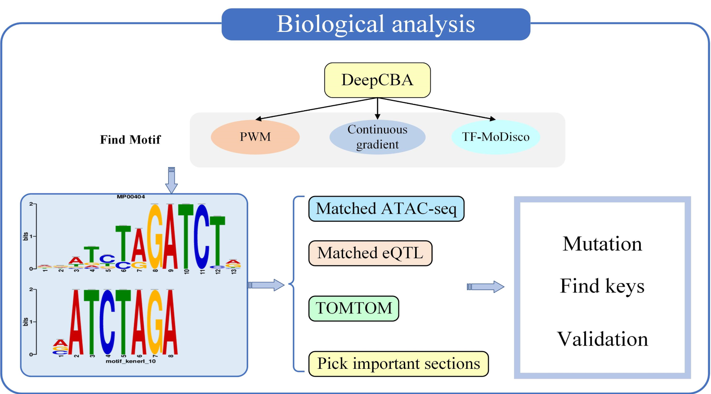
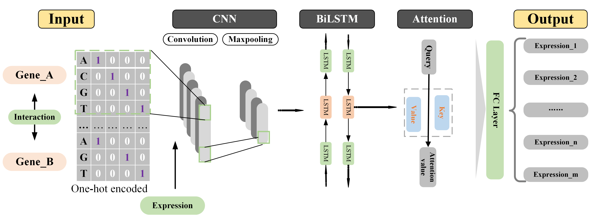
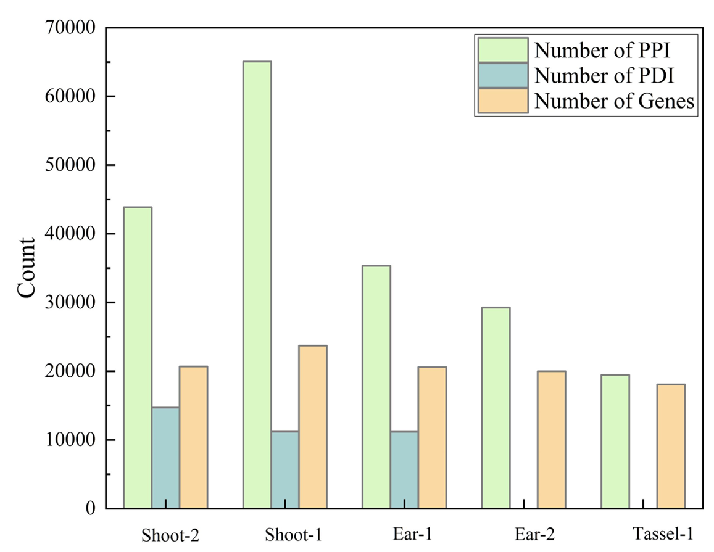
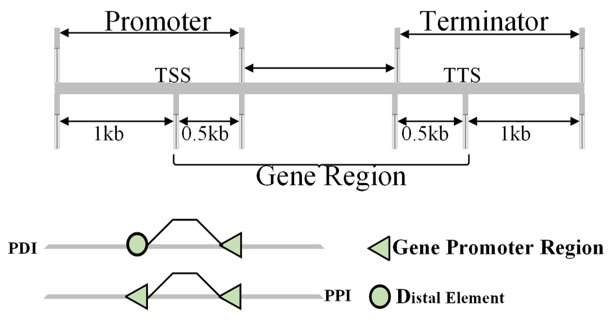

# Precise prediction of maize gene expression based on chromatin interactions using DeepCBA

  

## DeepCBA
**DeepCBA** is a high-precision maize gene expression prediction model, which includes *convolution neural network (CNN)*, *bidirectional long short-term memory network (BiLSTM)* and *self-attention mechanism*.  

For additional details, we kindly invite you to refer to the DeepSTARR publication:  
[*<ins>Precise prediction of maize gene expression based on chromatin interactions using DeepCBA</ins>*](tmp)  

We also offer you the online service version of DeepCBA. Please visit [*http://www.deepcba.com*](http://www.deepcba.com) for more information.

### DeepCBA Introduction
We built a deep learning mode called **DeepCBA** to predict *maize gene expression* based on *chromatin interactions*.  

*DeepCBA* includes three modules, and the *convolution neural network (CNN)* is used to extract features of the encoded chromatin sequence and reduce the dimensionality. The *bidirectional long short-term memory network (BiLSTM)* can capture bidirectional information and have the ability to capture dependencies between features by accessing long-range context. The *BiLSTM* is used to capture distal interactions among chromatin sequence features in this study. The *self-attention mechanism* is used to capture the contribution of key features for the model.
  

### Experimental Data Introduction
In this study, the experimental data utilized comprises published *maize chromatin interaction and expression data* from three distinct tissues: shoot, ear, and tassel ([Peng et al., 2019](https://www.nature.com/articles/s41467-019-10602-5); [Li et al., 2019](https://www.nature.com/articles/s41467-019-10603-4); [Sun et al., 2020](https://genomebiology.biomedcentral.com/articles/10.1186/s13059-020-02063-7)).  

*The chromatin interaction data* is divided into two categories based on the type of elements that interact with genes.  

- The *promoter proximal region interaction* (PPI) data, which includes five datasets: Shoot-2, Shoot-1, Ear-1, Ear-2, and Tassel-1.
- The *promoter distal region interactions* (PDI) data includes three datasets: Shoot-2, Shoot-1, and Ear-1.

The average interaction number of PPI in five datasets (Shoot-2, Shoot-1, Ear-1, Ear-2 and Tassel-1) is *38595*, and the average interaction number of PDI in three datasets (Shoot-2, Shoot-1 and Ear-1) is *12367*. Then we defined the DNA sequence for a specific gene as an inclusion of 1 kb upstream and 0.5 kb  downstream of the transcription start site (TSS), and 0.5 kb upstream and 1 kb downstream of the transcription termination site (TTS) ([Washburn et al., 2019](https://www.pnas.org/doi/full/10.1073/pnas.1814551116)).  

  

## Environment  

### CUDA Environment
If you are running this project using GPU, please configure CUDA and cuDNN according to this version.  
  
|  | Version |
|-----:|---------------|
|    CUDA    |    8.0    |
|    cuDNN    |    11.0    |  

### package Environment 
This project is based on Python 3.8.13. The required environment is as follows:  

|                 |    Version  |
|----------------:|-------------|
|    numpy        |    1.19.5   |
|    pandas       |    1.2.4    |
|    tensorflow   |    2.4.0    |
|    tf-keras-vis |    0.8.4    |
|    biopython    |    1.79     |
|    tqdm         |    4.62.3   |  

For more required packages, please refer to the [requirements.txt](requirements.txt) file in this project.

## Questions
If you have any questions, requests, or comments, we kindly invite you to contact us at [wangzhenye@webmail.hzau.edu.cn](wangzhenye@webmail.hzau.edu.cn), [liujianxiao321@webmail.hzau.edu.cn](liujianxiao321@webmail.hzau.edu.cn).
